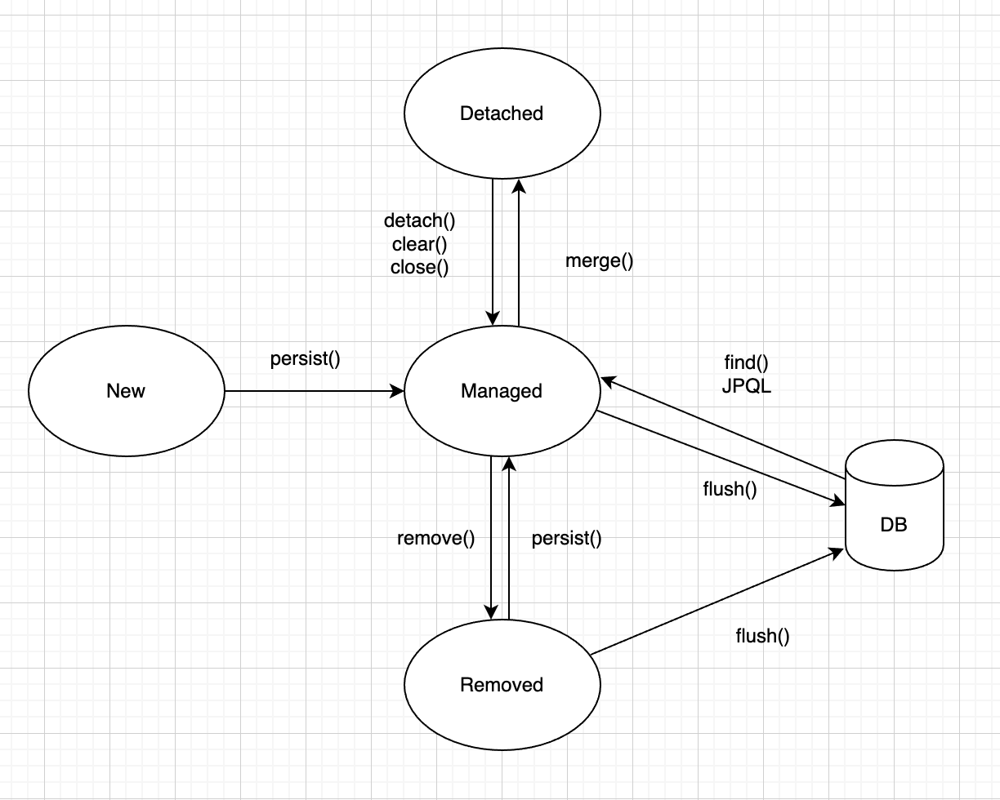

# jpa-programming

#### JPA를 사용하는 이유
- SQL <-> OOP 간의 패러다임 불일치를 해소할 수 있다.
  - 상속, 연관관계, 그래프 탐색, 동일성 비교 등
- 코드양이 줄어들기 때문에 생산성이 높아지고, 유지보수 하기 편하다.
- 데이터베이스에 대한 추상화가 되어 있어서 DB 변경에도 용이하다.

#### EntityManager
- EntityManagerFactory는 JPA를 위한 기반 객체를 만들고 DB 커넥션 풀도 생성하므로 
애플리케이션 전체에서 한 번만 생성하고 공유해서 사용하는 것이 좋다. EntityManager를 만드는 
비용은 거의 들지 않는다.
- EntityManagers는 여러 스레드가 동시에 접근하면 동시성 문제가 발생하므로 스레드 간에 공유하지 않는 것이 좋다.
- EntityManager를 통해서 엔티티를 DB에 CRUD할 수 있다.

```java
class Ex {
    public void transactionExample(EntityMananger em) {
        EntityTransaction tx = em.getTransaction();
        
        try {
            tx.begin();
            logic(em);
            tx.commit();
        } catch (Exception ex) {
            tx.rollback();
        }
        
    }
}
```

#### Persistence Context
- 엔티티를 영구 저장하는 환경
- 엔티티를 식별자 값(@Id)으로 구분한다. 영속 상태는 식별자 값이 반드시 있어야 한다.
- transaction commit 순간에 저장된 엔티티를 DB에 반영한다. (flush)
- 여러 가지 좋은 기능들이 있다.
  - 1차 캐시: 저장하기 전에 먼저 캐시에 저장해두고, 조회할 때도 먼저 캐시를 보고 없으면 조회 후에 1차 캐시에 저장한다.
  - 동일성 보장
  - 트랜잭션을 지원하는 쓰기 지연(transactional write-behind): 트랜잭션이 끝나기 전까지 CUD를 차곡차곡 모아두고 한 번에 실행한다.
  - 변경 감지(dirty checking) aka @DynamicUpdate, @DynamicInsert
    => 조회 시에 스냅샷을 찍어둔 엔티티를 트랜잭션 종료 시점과 비교해서 달라질 경우 변경
  - 지연 로딩

#### Entity의 생명주기

- 비영속(new/transient): persistence context와 관계가 없음
- 영속(managed): persistence context에 저장된 상태
- 준영속(detached): persistence context에 저장되었다가 분리된 상태
- 삭제(removed): 삭제된 상태

#### PK
엔티티는 식별자가 있어야 persistence context에 속할 수 있게 된다.
다음과 같은 기본키 매핑 방법이 있다.
- 직접 할당. em.persist()를 호출하기 전에 애플리케이션에서 식별자 값을 직접 할당한다.
- SEQUENCE: DB 시퀀스를 활용해서 식별자 값을 획득한다.
- TABLE: 시퀀스 생성용 테이블에서 식별자 값을 획득한다.
- IDENTITY: PK AUTO_INCREMENT 기능이 있는 데이터베이스를 사용할 때 해당 기능을 활용해서 식별자 값을 획득한다. *데이터를 저장해야 식별자 값을 획득할 수 있다.


#### 설정하기
spring.jpa.hibernate.ddl-auto 상용 환경에서는 create, create-drop, update와 같은 옵션은 사용하지 않는 것이 좋다.
